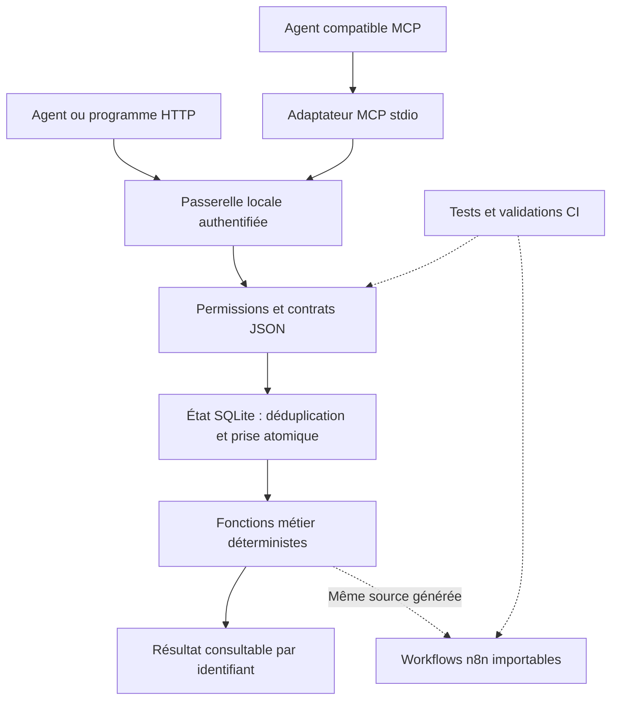

# Automation Systems Lab

**Des automatisations compréhensibles, testables et utilisables par différents agents IA.**

[](https://github.com/OneCosmicDev/automation-systems-lab/actions/workflows/ci.yml)

Ce projet montre comment passer d'une demande à une exécution suivie : décrire une automatisation, valider ses entrées, contrôler les permissions, éviter les doublons et retrouver son résultat. Il rassemble un service local HTTP, une interface MCP et trois workflows n8n reproductibles.

Les exemples sont reconstruits avec des données fictives. Aucun système client ni service de production n'est nécessaire pour essayer le projet.

**For English-speaking reviewers:** this is an agent-neutral automation reference implementation. Start with the [English overview](docs/overview.en.md), [architecture](docs/architecture.md), and `npm run demo`.

## À quoi ça sert ?

| Cas | Problème | Résultat démontré |
|---|---|---|
| Réception de prospects | Les coordonnées arrivent avec des formats différents | Validation, normalisation et routage vers une équipe |
| Rapport mensuel | Les calculs et comparaisons doivent rester vérifiables | Conversion et variations chiffrées ; cas de division par zéro explicites |
| Triage d'incidents | Toutes les erreurs ne demandent pas la même réponse | Distinction succès, erreur temporaire, erreur définitive et budget de reprise |

Les sorties sont des **simulations** : aucun courriel, SMS, message ou changement dans un CRM n'est envoyé. La règle métier est identique dans le moteur local et dans les exports n8n. Le moteur local n'appelle pas une instance n8n en arrière-plan : les deux chemins sont montrés et testés séparément.

## Essayer en deux minutes

Prérequis : Node.js **22.19+** ou **24 LTS**, et npm. Aucun compte externe, clé API ou modèle IA requis.

```sh
git clone https://github.com/OneCosmicDev/automation-systems-lab.git
cd automation-systems-lab
npm ci --ignore-scripts
npm run demo
```

La démonstration lance chaque cas deux fois avec la même clé. Les deux demandes retrouvent le même identifiant d'exécution. Le rapport affiche notamment une conversion de **5 %**, une hausse des visites de **20 %** et une hausse des prospects de **50 %** à partir des fixtures du dépôt.

```sh
npm run check     # Validation + tests des contrats, permissions et reprises
```

## Comment l'architecture est construite



L'agent choisit un outil et fournit des données. Les règles de validation et de permission s'appliquent dans le service, quel que soit l'agent. Les [décisions d'architecture](docs/decisions.md) expliquent les compromis.

## Connecter un agent

**Vous préférez que votre agent prépare l'environnement ?** Donnez-lui ce message depuis un environnement où il peut utiliser votre terminal et vos fichiers :

```text
Prépare mon environnement local à partir de https://github.com/OneCosmicDev/automation-systems-lab.
Lis docs/agent-bootstrap.md et exécute le prompt de démarrage qu'il contient.
Je veux connecter cet agent à n8n pour créer et tester des workflows.
Utilise des données fictives et demande-moi de saisir les secrets dans un emplacement privé, jamais dans le chat.
Vérifie la connexion avec un workflow réellement importé et exécuté avant de déclarer l'installation prête.
```

Le [prompt complet](docs/agent-bootstrap.md) prévoit l'installation, la connexion, les étapes manuelles éventuelles et la reprise. Il distingue le MCP du laboratoire du connecteur nécessaire pour piloter n8n. Ce parcours assisté dépend des outils et permissions de votre agent ; il ne constitue pas une installation universelle déjà certifiée.

Pour configurer uniquement le laboratoire à la main :

```sh
npm run setup    # Crée .env avec deux tokens locaux aléatoires, sans les afficher
npm start       # Lance le service sur 127.0.0.1:4317
```

Configurer ensuite un client MCP **stdio** avec `node`, le chemin absolu de `src/mcp.mjs` et le fichier `.env`. Un [exemple de configuration](examples/mcp-client.json) et un [guide HTTP/MCP](docs/agents.md) sont fournis.

| Droits | Outils |
|---|---|
| Exécution | `list_automations`, `describe_automation`, `run_automation`, `get_run` |
| Maintenance | Les précédents + `validate_workspace`, `plan_deployment` |

Le contrat de référence est [src/tools.mjs](src/tools.mjs). Deux clients MCP indépendants et un client HTTP sont testés ensemble. La compatibilité de chaque application d'agent doit être vérifiée ; tous les clients n'utilisent pas le même format de configuration.

## Explorer dans n8n

Importer un fichier de [workflows/](workflows/) dans votre propre instance n8n et exécuter le déclencheur manuel. Les fixtures sont intégrées et aucun credential n'est nécessaire. Les graphes restent inactifs et n'exposent aucun webhook.

Avec Docker Engine disponible :

```sh
npm run test:n8n  # Importe et exécute les trois graphes dans n8n 2.40.7
```

Le test utilise des conteneurs éphémères sans réseau. Pour importer via l'API dans une instance locale, voir [le guide d'exploitation](docs/operations.md). La planification n'effectue aucune mutation :

```sh
npm run deploy -- lead-intake
```

## Ce que les vérifications couvrent

- Vingt demandes simultanées retrouvent une seule exécution.
- Une même clé avec un contenu différent produit un conflit.
- La déduplication survit à la réouverture de la base.
- Plusieurs connexions SQLite ne peuvent pas prendre le même travail.
- Une exécution interrompue est signalée pour revue ; elle n'est pas rejouée aveuglément.
- Un agent d'exécution ne peut pas invoquer les outils de maintenance.
- Les règles exécutées dans les exports n8n restent identiques à la source.
- GitHub Actions vérifie Node 22/24 sous Windows/Linux, exécute les graphes dans n8n et analyse l'historique avec Gitleaks.

Consulter [les limites des preuves](docs/verification.md) avant d'interpréter ces tests comme une garantie de production.

## Évolution prévue

La version actuelle est conçue pour **un utilisateur ou une équipe de confiance, un hôte et une passerelle**. Elle fournit des points de départ pour une architecture plus grande, sans prétendre être un service multi-client prêt à héberger.

Les prochains paliers sont décrits dans [ROADMAP.md](ROADMAP.md) : intégrations réelles avec idempotence côté destination, backend n8n distant, authentification par identité, stockage transactionnel partagé et mesures de charge. La capacité maximale n'a pas été mesurée.

## Repères dans le dépôt

| Dossier | Responsabilité |
|---|---|
| `src/automations.mjs` | Règles métier et schémas des trois cas |
| `src/tools.mjs` | Contrat commun et contrôle des droits |
| `src/store.mjs` | États persistants et opérations atomiques |
| `src/http.mjs`, `src/mcp.mjs` | Interfaces d'accès |
| `workflows/` | Exports n8n générés, sans état de production |
| `test/` | Vérifications reproductibles |
| `docs/` | Architecture, exploitation, décisions et connaissances |

Projet de portfolio maintenu par [OneCosmicDev](https://github.com/OneCosmicDev). Le code de cette référence a été développé avec l'assistance d'un agent de programmation. Les dépendances conservent leurs licences respectives. Aucune licence générale de réutilisation du code de ce dépôt n'est accordée à ce stade ; voir [NOTICE.md](NOTICE.md).
