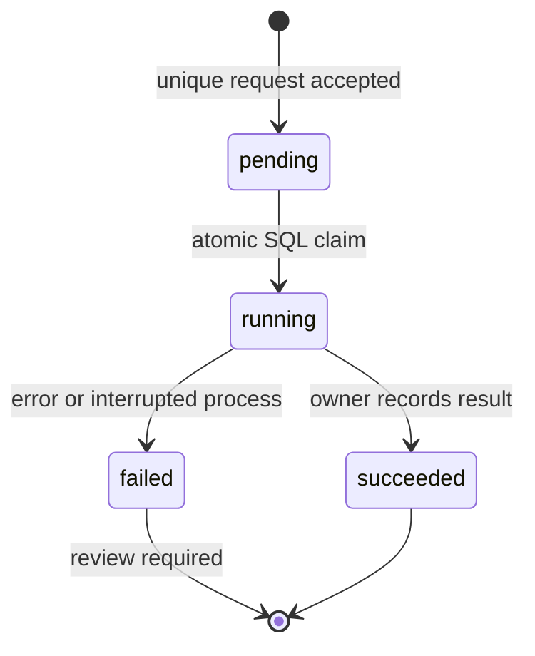

# Architecture and boundaries

## Purpose

Make an automation understandable to a person and callable through a stable contract by different agents. The reference includes executable examples, permission enforcement, durable deduplication, and verification that does not depend on an agent remembering a prompt.

## Two explicit execution paths

1. **Agent path:** MCP stdio or HTTP → authenticated loopback gateway → shared tool contract → SQLite run record → pure business function → stored result.
2. **n8n path:** imported manual workflow → synthetic fixture → the exact same generated business function → structured result. n8n has its own execution history.

These are separate paths. The n8n examples do not share the gateway's SQLite run registry, and MCP does not currently trigger n8n. A remote n8n adapter is a future integration, not a hidden dependency of the demo. This separation keeps the first experience runnable without external accounts and makes the engine boundary explicit.

## Layers

| Layer | Implementation | Invariant |
|---|---|---|
| Transport | HTTP + MCP stdio bridge | No duplicated business logic |
| Contract | JSON Schema + domain validation | Validate before accepting a job |
| Authorization | Runner / maintainer bearer tokens | The server decides capabilities; tool arguments cannot promote roles |
| State | SQLite WAL + unique request key | A request key identifies one versioned payload |
| Execution | Pure allowlisted functions | No arbitrary submitted code or external effects |
| Artifacts | Generated n8n JSON | Source and exported behavior stay in sync |
| Knowledge | Decisions + verified lessons | Record evidence and limitations, not secrets or untested claims |
| Verification | Node tests + n8n integration + secret scan | Deterministic checks run independently of agent instructions |

## Lifecycle and concurrency

The request fingerprint covers automation ID, version and a canonicalized input. A unique constraint on the key prevents two inserts from creating duplicate jobs. An `UPDATE ... WHERE status='pending' RETURNING ...` lets exactly one database connection claim the row. Completion requires the same owner and a running state.

The production entry point permits one gateway process per working directory through an exclusive lock file. On startup, orphaned running records become `INTERRUPTED_REVIEW_REQUIRED`; pending records resume. There is no automatic claim expiry, so a slow operation cannot lose its claim to another worker. This is a deliberate single-host policy, not a distributed scheduler.

Retries are limited to a named synthetic transient adapter failure, up to three attempts. The default business functions are pure and normally do not retry. Real external actions need destination idempotency, an outbox and a reconciliation strategy before enabling retries. A database transaction cannot by itself guarantee exactly-once email delivery.

## Security boundaries

- Listener restricted to `127.0.0.1`; bearer token required for every route.
- Browser Origin headers and unexpected Host headers are rejected. No CORS allowlist is enabled.
- Two distinct randomly generated tokens; runner cannot call maintenance tools.
- One shared trusted workspace: tokens are roles, not tenant identities. Both roles can read runs in that workspace.
- JSON-only requests; 64 KiB body bound; rate limit of 120 requests/minute per role.
- Errors returned to clients use fixed codes. Provider payloads and credentials are not logged.
- Local state and `.env` are excluded from Git. SQLite input/output data is not encrypted by this application.
- The local operating-system account is trusted; this is not a sandbox for a malicious local user.

See [SECURITY.md](../SECURITY.md) for publication and reporting boundaries.

## Scaling assessment

Adding a workflow is supported by the catalog/function/generator pattern. Adding an agent is supported by the common API. Adding machines is not implemented.

For multiple hosts, replace the store with PostgreSQL transactions, introduce durable queue ownership with fencing, and separate workers from ingress. Keep external effects idempotent and monitor queue age, failure rates, latency and provider quotas. The n8n execution tier can use Redis-backed queue mode and workers; that is distinct from the business-level idempotency ledger.

No throughput or availability objective has been measured. Node's built-in SQLite API may emit an experimental warning on Node 22. For production, choose and validate the supported runtime/storage versions independently.

References: [MCP tools](https://modelcontextprotocol.io/specification/2025-11-25/server/tools), [MCP transports](https://modelcontextprotocol.io/specification/2025-11-25/basic/transports), [n8n queue mode](https://docs.n8n.io/deploy/host-n8n/configure-n8n/scaling/enable-queue-mode.md).
